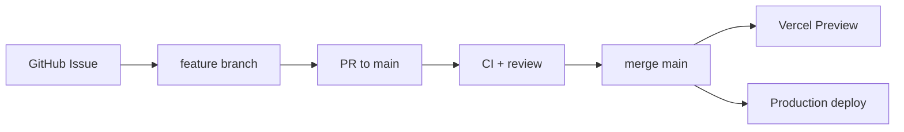

# Platform v2 分支策略

## 目标

在多仓（portal / auth / api / dochub / chat）并行演进时，保持：

1. `main` 始终可部署
2. 跨仓契约变更可追踪
3. Cloud Agent / 人工 PR 命名一致

## 默认分支

| 仓库 | 默认分支 | 说明 |
| --- | --- | --- |
| portal / auth / node-vercel-starter | `main` | 生产与 Preview 的基线 |
| dochub / chat | `main` | 仓体落地前可为空 |

历史规划中的 `platform/v2` **不再作为长期集成分支**；若需阶段性冻结，用 tag（如 `platform-v2-p0`）代替长寿命分支。

## 分支命名

| 类型 | 模式 | 示例 |
| --- | --- | --- |
| 功能 | `feat/<scope>-<slug>` | `feat/portal-chat-token` |
| 修复 | `fix/<scope>-<slug>` | `fix/auth-callback-cookie` |
| 文档 | `docs/<slug>` | `docs/sync-protocol` |
| Cursor Agent | `cursor/<slug>-<id>` | `cursor/platform-init-next-f995` |

跨仓同一需求尽量共用相同 `<slug>`，便于在 Issues / PR 标题中检索。

## 工作流

1. **从 Issue 开分支**：PR 描述链接对应 Issue（portal / auth / starter）。
2. **单仓 PR**：一次 PR 只改一个仓库；契约变更先合并「提供方」仓，再合并「消费方」仓。
3. **契约顺序建议**：
   - API / DB schema（starter + Supabase migration）
   - 共享类型 / SDK（portal packages 或 auth packages）
   - 应用接入（portal apps / auth apps / chat）
4. **禁止 force-push `main`**；Agent 分支可 rebase，已开 PR 后优先 merge commit / squash。

## 发布与环境

| 环境 | 触发 | 域名 |
| --- | --- | --- |
| Preview | PR / 非 main 推送 | Vercel 预览 URL |
| Production | merge 到 `main` | `www` / `auth` / `api`.acongm.com |

生产切流、DNS、回滚步骤见 `[P4-06] 域名切换 Runbook`（待编写）。

## 与 DocHub 同步的关系

Git 仍是文档的权威源之一；DB 侧版本只追加。同步状态机见 [sync-protocol.md](./sync-protocol.md)。
涉及 `content/docs` 的批量迁移脚本在 portal `scripts/`，合并前需跑 `pnpm build` 与文档链接检查。
