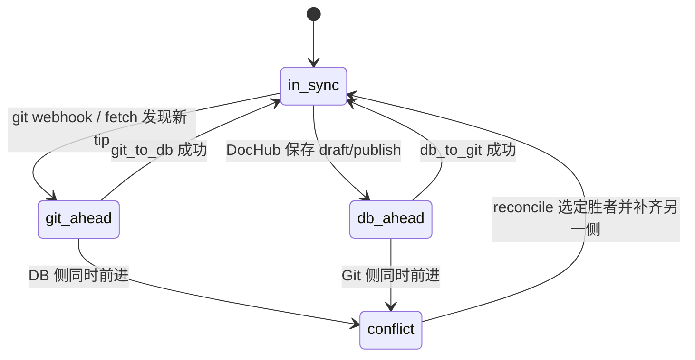

# Git ↔ DB 同步协议（Platform v2）

依据 `node-vercel-starter/supabase/migrations/001_platform_v2.sql`。
原则：**`document_versions` 只追加、不覆盖、不因失败删除**。

## 核心对象

| 对象 | 作用 |
| --- | --- |
| `document_versions` | 不可变版本行（content + content_hash + source + 可选 git_sha） |
| `document_heads` | 每个 `(namespace_id, path)` 的当前头指针与 `sync_state` |
| `sync_jobs` | 同步任务（`git_to_db` / `db_to_git` / `reconcile` / …） |
| `sync_failures` | 可重试失败记录（版本本身保留） |

### `sync_state`（document_heads）

| 状态 | 含义 |
| --- | --- |
| `in_sync` | Git 与 DB 头一致（hash / git_sha 对齐） |
| `git_ahead` | Git 有更新尚未进 DB |
| `db_ahead` | DB draft/current 领先于 Git |
| `conflict` | 双方在共同祖先之后都有变更 |

## 任务类型

| `job_type` | 方向 | 行为摘要 |
| --- | --- | --- |
| `git_to_db` | Git → DB | 读 Git blob → **insert** 新 `document_versions` → 更新 head.current |
| `db_to_git` | DB → Git | 取 draft/current → commit/PR 或直推 publishBranch → 回写 `git_sha` |
| `reconcile` | 双向裁决 | 对比三方（base / git / db），产出合并版本或标记人工 |
| `pipeline` | 派生 | KB 分析 / chunk（不改原文权威） |
| `webhook` | 触发器包装 | GitHub push 等转成上述 job |

`sync_jobs.status`：`pending → running → succeeded | failed | cancelled`。

## 冲突场景表

| # | Git tip vs 上次同步 | DB current/draft | 进入状态 | 自动策略 | 人工介入 |
| --- | --- | --- | --- | --- | --- |
| 1 | 无变化 | 无变化 | `in_sync` | 无 | 否 |
| 2 | 前进（快进） | 无变化 | `git_ahead` → `in_sync` | `git_to_db` 追加版本，移动 current | 否 |
| 3 | 无变化 | draft/current 前进 | `db_ahead` → `in_sync` | `db_to_git` 提交后回写 sha | 否 |
| 4 | 前进 | 同路径也前进且 hash 不同 | `conflict` | 创建双方版本行；**不覆盖**；开 reconcile | 可选 |
| 5 | 前进 | draft 存在但 hash 与 Git 相同 | `in_sync` | 对齐指针，清冗余 draft 指针（不删版本行） | 否 |
| 6 | force-push / history rewrite | 任意 | `conflict` 或失败 | 记 `sync_failures`；保留旧版本 | 是 |
| 7 | 文件删除 | DB 仍有 head | `git_ahead` | 追加 tombstone/删除元数据；不物理删历史版本 | 按产品策略 |
| 8 | job 中途失败 | 已插入部分版本 | 保持原状态或 `conflict` | 版本保留；写 `sync_failures` 可重试 | 多次失败后人工 |

### reconcile 默认裁决（可配置）

1. **显式胜者**：指定 `winner=git|db` → 追加结果版本 → 另一侧补齐 → `in_sync`
2. **三路合并**：可自动合并则追加 merge 版本；否则保持 `conflict`
3. **禁止**：update/delete 已有 `document_versions` 行

## 失败与重试

`sync_failures`：`failure_code` / `reason` / `context` / `retry_count` / `next_retry_at` / `resolved_at`。
失败不得回滚已写入的 version 行；重试按 `content_hash` / `git_sha` 幂等插入。

## API 层约束

1. 对 `document_versions` 仅允许 `INSERT` + `SELECT`
2. 移动头指针只更新 `document_heads`
3. 每次同步写 `sync_jobs`；失败同时写 `sync_failures`
4. 「当前文档」一律经 `document_heads.current_version_id` 解析

## 验收对照（P0-02）

- [x] 状态机覆盖 `in_sync` / `git_ahead` / `db_ahead` / `conflict`
- [x] 任务类型覆盖 `git_to_db` / `db_to_git` / `reconcile` + 失败表
- [x] 冲突场景表完整
- [x] 明确版本只追加不覆盖
